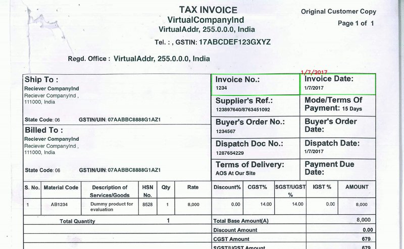
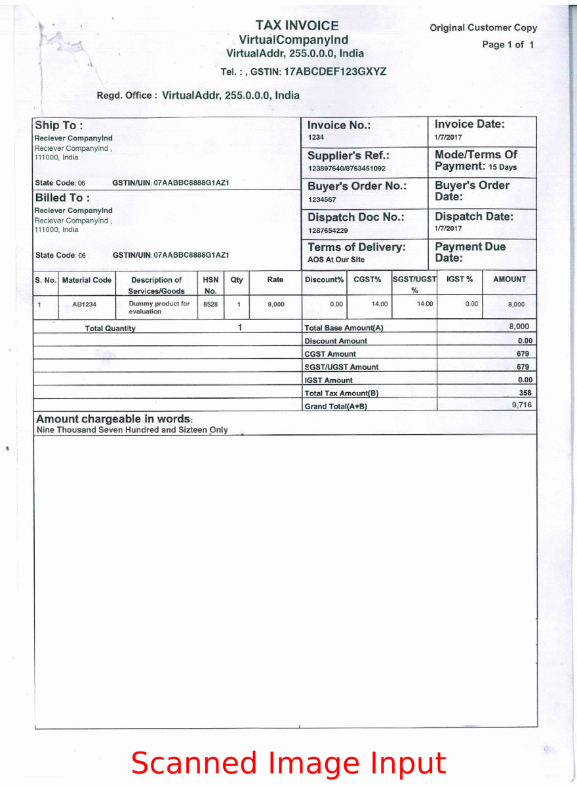

# Invo-AI: Intelligent Invoice Data Extraction 📄🤖

 <!-- Or Active if you maintain it -->
 <!-- Add a LICENSE file if applicable -->

  
   
  <em>Automated data extraction from scanned invoices using Computer Vision and OCR.</em>

---

## 🎯 Problem Statement

Manually extracting structured data (like vendor names, invoice numbers, line items, totals) from diverse scanned invoices is tedious, error-prone, and time-consuming. Existing solutions can be costly or struggle with varied templates and layouts.

## ✨ Solution: Invo-AI

**Invo-AI** is a Python-based system designed to automatically parse scanned invoice documents (PDF/Images), accurately extract key information fields and line items, and structure the output into a usable format (XML). It leverages a combination of image processing, layout analysis, and optical character recognition (OCR).

## 🔥 Key Features & Performance

*   **Automated Extraction:** Extracts key fields and table data from invoices.
*   **Layout-Aware Parsing:** Intelligently identifies information regions and table structures.
*   **High Accuracy:** Achieved **87% precision** on key field extraction, **outperforming Google Cloud Vision's 80%** on the project's benchmark dataset.
*   **Structured Output:** Exports extracted data to XML format for easy downstream integration.
*   **Adaptable:** Core logic designed to handle variations in invoice templates.

## 🛠️ Core Approach & Technology

Invo-AI employs a multi-stage pipeline:

1.  **Preprocessing:** Converts input PDFs to images and applies image enhancement techniques (Gaussian Blur, Binarization, Dilation/Erosion) to improve text clarity and structure detection.
2.  **Layout Analysis & Text Detection:** Utilizes the **CRAFT (Character Region Awareness for Text Detection)** model to accurately detect text regions (words, lines) and their bounding boxes, effectively handling dense text and varied layouts. Custom logic identifies potential table regions based on detected grid structures or alignments.
    *   *(Note: While EfficientDet was explored, CRAFT proved more effective for line/word level detection on the project data).*
3.  **Optical Character Recognition (OCR):** Employs the **Tesseract OCR engine (LSTM)** to recognize characters within the detected bounding boxes.
    *   *(Note: Explored other recognition models, but Tesseract provided strong performance, especially considering potential fine-tuning).*
4.  **Information Extraction & Structuring:** Applies rule-based logic and keyword searching (e.g., "Invoice No", "Total Amount", table headers) on the OCR results and their spatial locations (bounding boxes) to:
    *   Identify and extract key-value pairs from the non-tabular sections.
    *   Detect table boundaries and extract line items row by row.
    *   Map extracted data to a structured XML format.

  
   
  <em>Example of table structure identification.</em>

## 💻 Tech Stack

*   **Language:** Python
*   **Core Libraries:** OpenCV (`opencv-python`), Tesseract (`pytesseract`), NumPy
*   **PDF Handling:** `pdf2image`
*   **Deep Learning (Detection):** Model based on CRAFT (Implementation used PyTorch)
*   **Pandas/YOLOv10**

## 🚀 Getting Started

### Prerequisites

*   Python 3.7+
*   Tesseract OCR Engine installed and configured (including adding it to your system's PATH). See [Tesseract Installation Guide](https://tesseract-ocr.github.io/tessdoc/Installation.html).
*   Required Python packages (see `requirements.txt` - *You should create this file!*)

